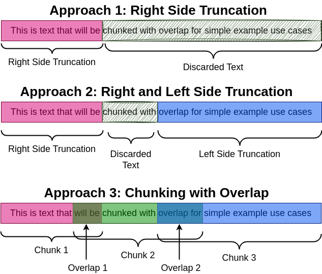

<h1 align="center">
  NLP Essentials with Hugging Face
</h1>

A comprehensive guide to NLP workflows using Hugging Face, focusing on data preparation, model training, and practical applications.

 

<a href="#getting-started">Getting Started</a> &nbsp;&bull;&nbsp;
<a href="#example-notebooks">Example Notebooks</a> &nbsp;&bull;&nbsp;
<a href="#contributions">Contributions</a> &nbsp;&bull;&nbsp;
<a href="#contact">Contact</a>

  
  
  

Welcome to the **NLP Essentials with Hugging Face** repository! 🎉 This repository is a collection of useful examples and notebooks to help you get the most out of the Hugging Face ecosystem, including `datasets`, `tokenizers`, `collators`, and various NLP models.

<h1 id="getting-started">🚀 Getting Started</h1>
This repository is designed to be a go-to resource for anyone looking to:

- **Work with Hugging Face Datasets**: Learn how to load, manipulate, and utilize datasets effectively.
- **Leverage Tokenizers**: Explore different tokenization strategies and how to implement them in your projects.
- **Implement Data Collators**: Understand how to use data collators for different data chunking strategies.
- **Develop NLP Applications**: Discover how to implement NLP models for tasks such as Named Entity Recognition (NER), Question Answering, and more.

<h1 id="example-notebooks">📚 Example Notebooks</h1>

## Preprocessing: Datasets, Tokenizers, and Collation

Learn how to load, process, and tokenize datasets using Hugging Face’s datasets and transformers libraries. Explore different data collation strategies, including padding and truncation, to prepare batches for training.

**1) [Notebook | tokenizer-three-approaches](./notebooks/tokenizer-three-approaches.ipynb)**: This notebook provides a walkthrough of chunking and splitting text with a Hugging Face tokenizer. 

**2) [Notebook | tokenizer-three-approaches-with-chat-template](./notebooks/tokenizer-three-approaches-with-chat-template.ipynb)**: This notebook provides a walkthrough of chunking and splitting text with a Hugging Face tokenizer using a [Chat Template](https://huggingface.co/docs/transformers/main/en/chat_templating).  

**3) [Notebook | dataset-collator](./notebooks/dataset-collator.ipynbipynb)**: This notebook demonstrates how to effectively utilize a [data collator](https://huggingface.co/docs/transformers/en/main_classes/data_collator) to prepare inputs for a model. 

### Text Chunking Strategies:
Different text truncation and chunking strategies are crucial for ensuring that models can effectively process input sequences that exceed the model's maximum input length. Choosing the appropriate strategy can significantly impact model performance and the quality of predictions.

- **Approach 1: Right-Side Truncation**: Handle sequences that exceed the model’s maximum input length by truncating tokens from the right side. Right-side truncation often discards older information.
- **Approach 2: Left-Side Truncation**: Truncate sequences from the left side, keeping the most recent information.
- **Approach 3: Chunking with Overlap**: Split long sequences into overlapping chunks to preserve context while handling large text inputs.

<b>Padding and Truncation</b>

Below is the [Hugging Face - Padding and Truncation](https://huggingface.co/docs/transformers/en/pad_truncation) reference table.

| Truncation                               | Padding                             | Instruction                                                                                           |
|------------------------------------------|-------------------------------------|-------------------------------------------------------------------------------------------------------|
| no truncation                            | no padding                          | `tokenizer(batch_sentences)`                                                                           |
|                                          | padding to max sequence in batch    | `tokenizer(batch_sentences, padding=True)` or `tokenizer(batch_sentences, padding='longest')`           |
|                                          | padding to max model input length   | `tokenizer(batch_sentences, padding='max_length')`                                                     |
|                                          | padding to specific length          | `tokenizer(batch_sentences, padding='max_length', max_length=42)`                                      |
|                                          | padding to a multiple of a value    | `tokenizer(batch_sentences, padding=True, pad_to_multiple_of=8)`                                       |
| truncation to max model input length     | no padding                          | `tokenizer(batch_sentences, truncation=True)` or `tokenizer(batch_sentences, truncation=STRATEGY)`      |
|                                          | padding to max sequence in batch    | `tokenizer(batch_sentences, padding=True, truncation=True)` or `tokenizer(batch_sentences, padding=True, truncation=STRATEGY)` |
|                                          | padding to max model input length   | `tokenizer(batch_sentences, padding='max_length', truncation=True)` or `tokenizer(batch_sentences, padding='max_length', truncation=STRATEGY)` |
|                                          | padding to specific length          | Not possible                                                                                           |
| truncation to specific length            | no padding                          | `tokenizer(batch_sentences, truncation=True, max_length=42)` or `tokenizer(batch_sentences, truncation=STRATEGY, max_length=42)` |
|                                          | padding to max sequence in batch    | `tokenizer(batch_sentences, padding=True, truncation=True, max_length=42)` or `tokenizer(batch_sentences, padding=True, truncation=STRATEGY, max_length=42)` |
|                                          | padding to max model input length   | Not possible                                                                                           |
|                                          | padding to specific length          | `tokenizer(batch_sentences, padding='max_length', truncation=True, max_length=42)` or `tokenizer(batch_sentences, padding='max_length', truncation=STRATEGY, max_length=42)` |

<h1 id="contributions">🌟 Contributions</h1>
Contributions are welcome! If you have a tip, trick, or notebook that you think would be valuable to the community, feel free to submit a pull request or open an issue.

<h1 id="contact">✉️ Contact</h1>
If you have any questions, suggestions, or feedback, feel free to reach out by opening an issue.

Happy coding! 🛠️

